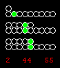



## Ball Clock

### Description

Uses the 'Time' function to manipulate the vb Shape control, basically just a fun way of seeing what time it is.
 
### More Info
 
This code returns the time in a cool abacus like format

             |
---                |---
**Submitted On**   |2000-09-06 13:48:08
**By**             |[Sid McCauley](https://github.com/Planet-Source-Code/PSCIndex/blob/master/ByAuthor/sid-mccauley.md)
**Level**          |Intermediate
**User Rating**    |5.0 (10 globes from 2 users)
**Compatibility**  |VB 6\.0
**Category**       |[Complete Applications](https://github.com/Planet-Source-Code/PSCIndex/blob/master/ByCategory/complete-applications__1-27.md)
**World**          |[Visual Basic](https://github.com/Planet-Source-Code/PSCIndex/blob/master/ByWorld/visual-basic.md)
**Archive File**   |[CODE\_UPLOAD9689962000\.zip](https://github.com/Planet-Source-Code/sid-mccauley-ball-clock__1-11309/archive/master.zip)

